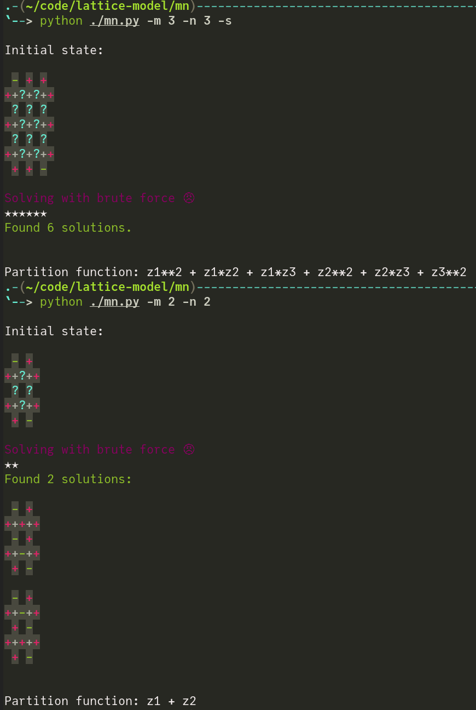

# Table of Contents

1.  [usage](#orgfd78210)
2.  [disclaimer](#org56185ab)
3.  [dependencies](#org6bf0e06)

# usage

First, ensure the [dependencies](#org6bf0e06) are met.

SYNOPSIS:

    mn.py [OPTION...]
    num_cols and num_rows default to 3 unless specified.
    Options:
            -m, --num_cols   Number of columns.
            -n, --num_rows   Number of rows.
            -h               give this help.
            -s               suppress output of solutions

# disclaimer

The program currently uses a very naive brute-force solver, which stucks even for lattices as small as 4x4.

Please let me know if you have ideas on improving the program (the algorithm, in particular).

# dependencies

-   numpy
-   sty
-   sympy

